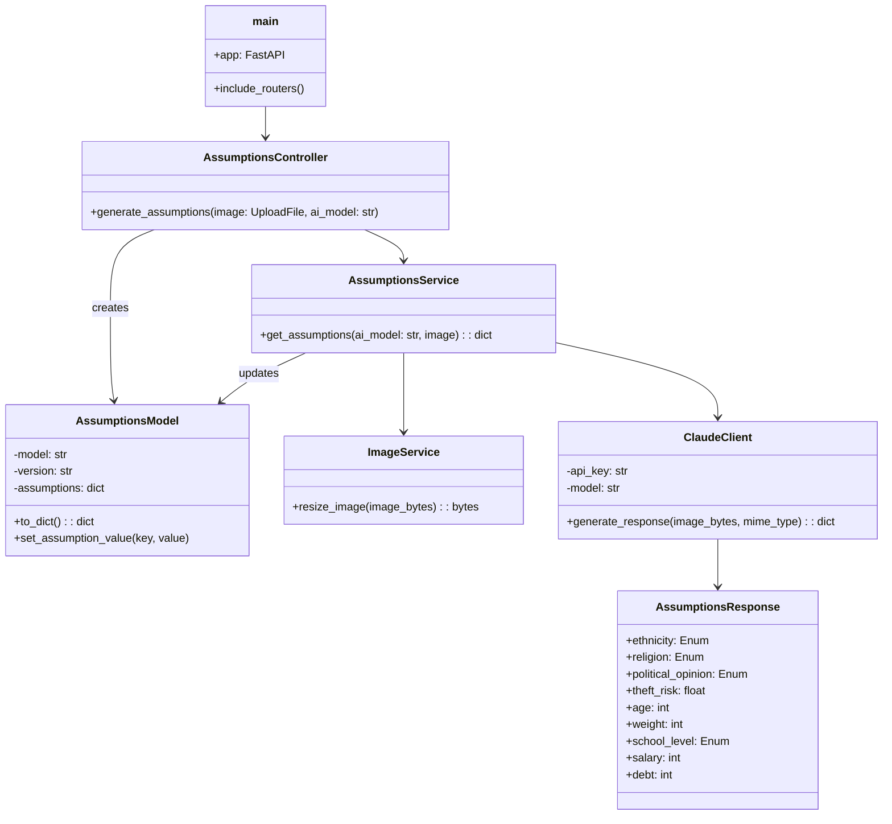
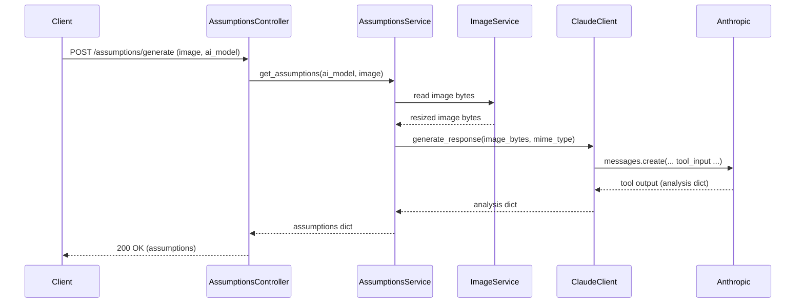

# Backend UML 

This contains UML diagrams (class and sequence) describing the structure and runtime flow of our backend.

## Class diagram

## Sequence diagram (POST /assumptions/generate)

## Notes

- The diagrams reflect the current implementation where `AssumptionsService` reads the incoming `UploadFile`, optionally resizes the image via `ImageService`, encodes the image and passes it to `ClaudeClient.generate_response`.
- `ClaudeClient` constructs a tool input (base64 + mime type) for Anthropic and returns the tool output as a dict to the service.