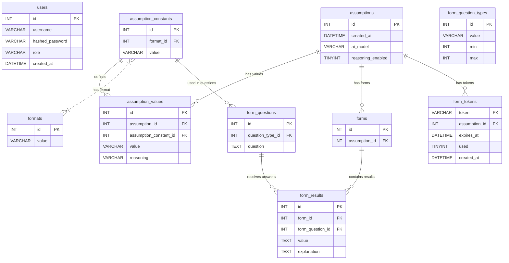

# Database ERD

```mermaid
erDiagram
    users {
        INT id PK
        VARCHAR username 
        VARCHAR hashed_password
        VARCHAR role
        DATETIME created_at
    }

    assumptions {
        INT id PK
        DATETIME created_at
        VARCHAR ai_model
        TINYINT reasoning_enabled
    }

    assumption_constants {
        INT id PK
        INT format_id FK
        VARCHAR value
    }

    assumption_values {
        INT id PK
        INT assumption_id FK
        INT assumption_constant_id FK
        VARCHAR value
        VARCHAR reasoning
    }

    forms {
        INT id PK
        INT assumption_id FK
    }

    form_question_types {
        INT id PK
        VARCHAR value
        INT min
        INT max
    }

    form_questions {
        INT id PK
        INT question_type_id FK
        TEXT question
    }

    form_results {
        INT id PK
        INT form_id FK
        INT form_question_id FK
        TEXT value
        TEXT explanation
    }

    formats {
        INT id PK
        VARCHAR value
    }

    form_tokens {
        VARCHAR token PK
        INT assumption_id FK
        DATETIME expires_at
        TINYINT used
        DATETIME created_at
    }

    %% Relationships
    assumptions ||--o{ assumption_values : "has values"
    assumption_constants ||--o{ assumption_values : "defines"
    
    assumption_constants }|..|{ formats : "has format"

    assumptions ||--o{ forms : "has forms"
    assumption_constants ||--o{ form_questions : "used in questions"
    form_questions ||--o{ form_results : "receives answers"
    forms ||--o{ form_results : "contains results"
    assumptions ||--o{ form_tokens : "has tokens"
```
