# Documentatie Society 5.0

## Inhoudsopgave

- [Documentatie Society 5.0](#documentatie-society-50)
  - [Inhoudsopgave](#inhoudsopgave)
  - [Prototype](#prototype)
    - [Afbeeldingen](#afbeeldingen)
  - [Dag 1](#dag-1)
  - [Dag 2](#dag-2)
  - [Reflectie](#reflectie)
    - [Tijdens de expo hoopten we op de volgende resultaten](#tijdens-de-expo-hoopten-we-op-de-volgende-resultaten)
    - [Wat ging goed?](#wat-ging-goed)
    - [Wat gingen niet zoals verwacht](#wat-gingen-niet-zoals-verwacht)
  - [Wat nemen we mee?](#wat-nemen-we-mee)

## Prototype

Voor ons prototype hebben wij een 'photo booth' gemaakt. Het fotohokje heeft een camera en een beeldscherm. Voor de bouw van het prototype, zie [deze pagina](../booth/index.md).

De resultaten die uit de foto's kwamen waren niet gebaseerd op de gemaakte foto, maar puur op toeval. Dit kwam door de korte tijd die we hadden om het prototype te maken. Het doel van het prototype was dan ook niet om accurate voorspellingen te doen, maar om de gebruikers een bepaald gevoel te geven bij het maken van een foto.

Tegenwoordig gebruiken veel mensen AI Chatbots zoals ChatGPT om informatie te verkrijgen. Het probleem hiervan is dat niet iedereen door heeft dat deze informatie van nature onbetrouwbaar is. Dit is blijkt echter niet altijd duidelijk voor de gebruikers wanneer zij een vraag stellen, het antwoord wordt vaak als feit verwoord. Ons doel met de photo booth is dan ook om mensen aan het denken te zetten over de betrouwbaarheid van AI en de informatie die zij verstrekken. Door aannames die je helemaal niet uit een foto kunt halen, te presenteren als feit, hopen we dat mensen zich bewust worden van de beperkingen van AI en kritisch gaan nadenken over de informatie die zij ontvangen.

### Afbeeldingen

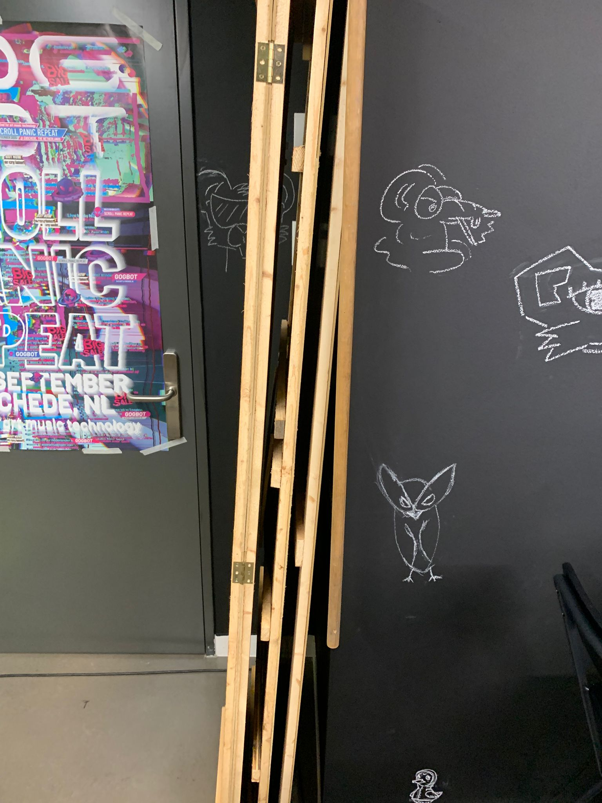  
_Foto booth losse wanden_

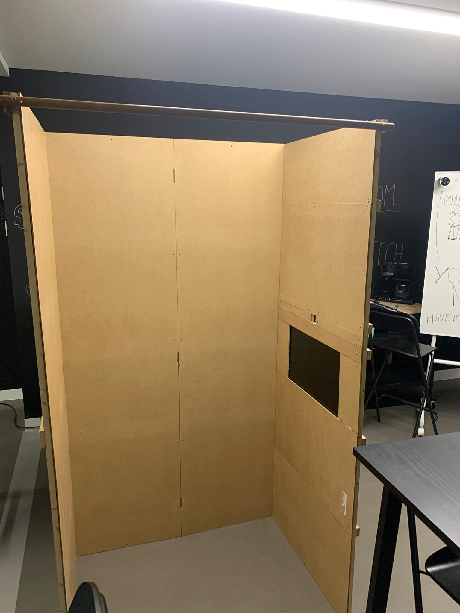  
_Foto booth in elkaar gezet in Dark Tech lokaal Wibautshuis_

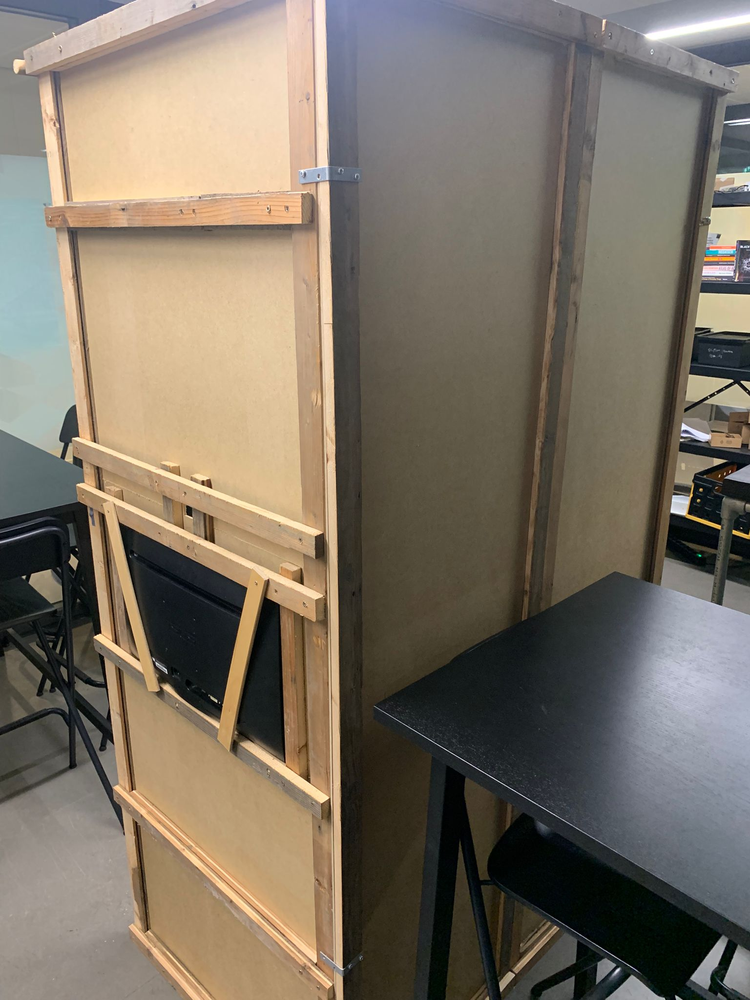  
_Achterzijde photo booth met scherm en camera_

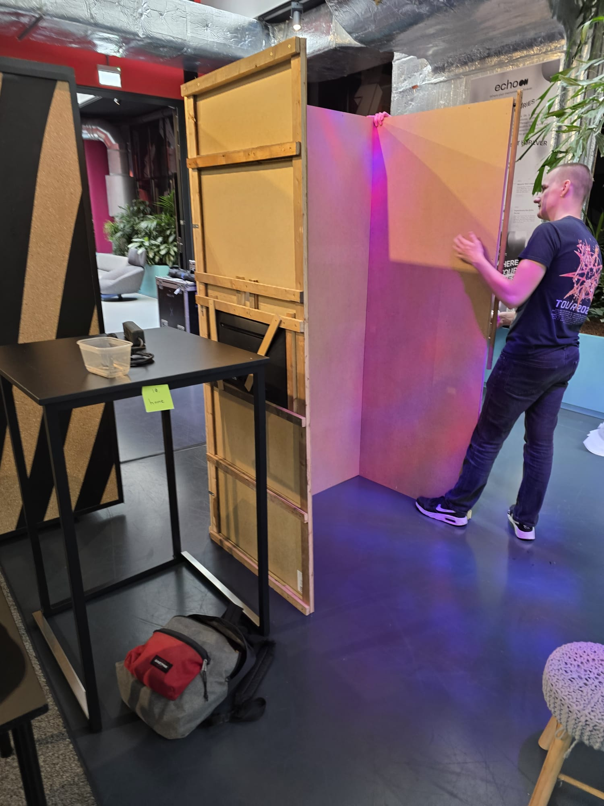  
_Photo booth opzet in Society 5.0_

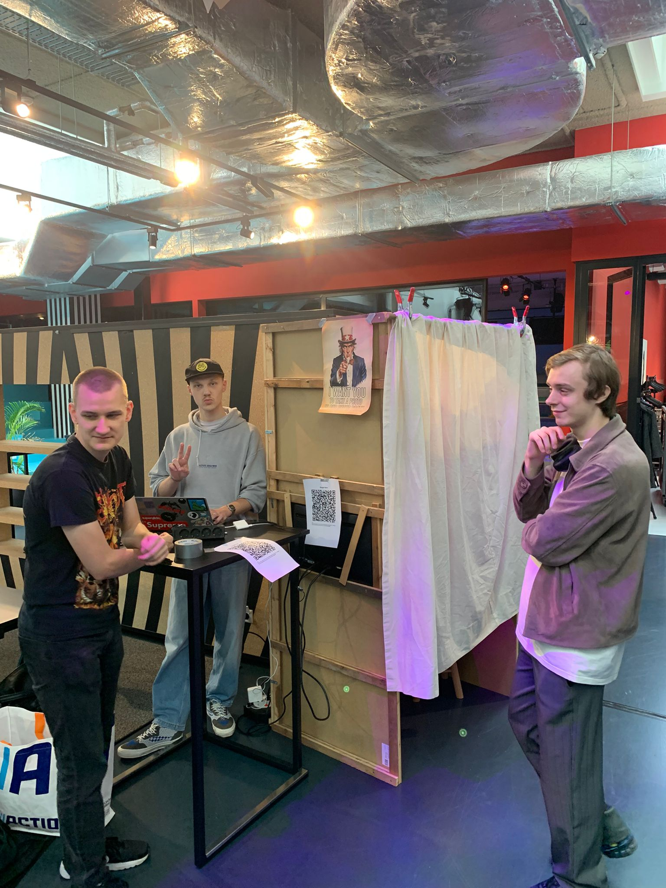  
_Start dag 1 Society 5.0_

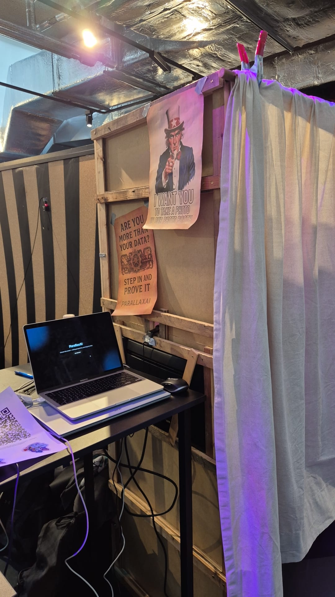  
_Photo booth alles opgesteld en aangesloten buitenzijde_

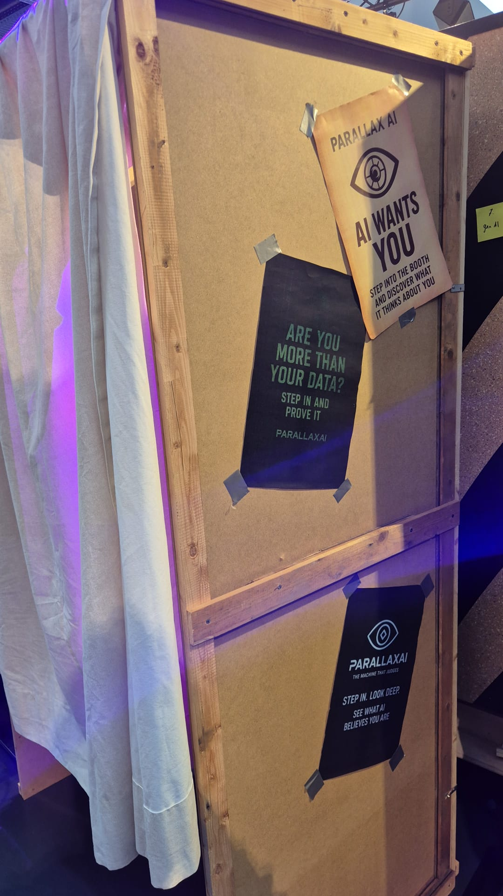  
_Posters op de muren van de photo booth_

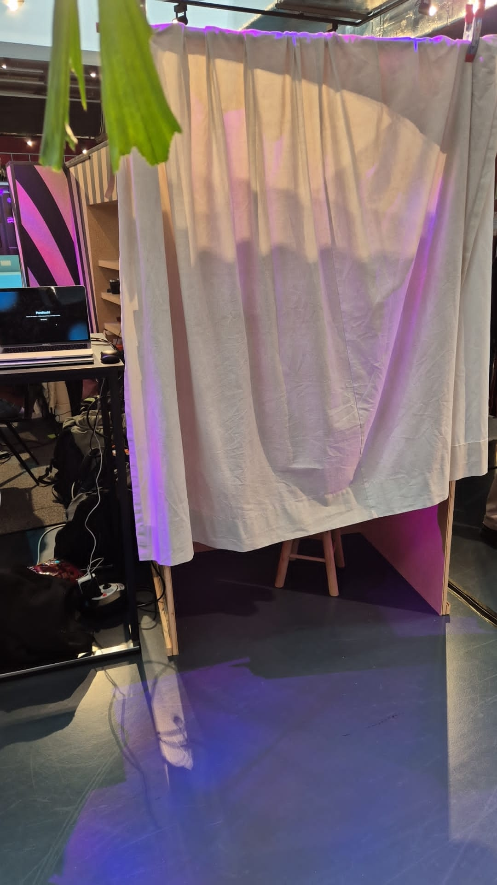  
_Photo booth buitenzijde_

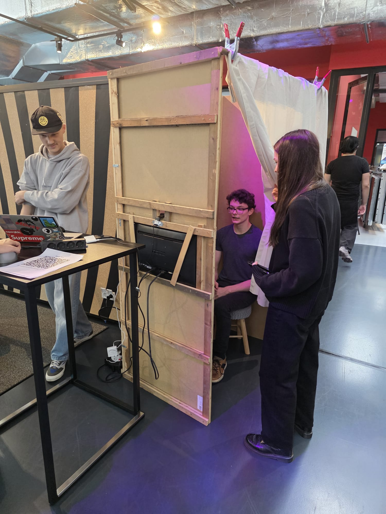  
_Foto booth in gebruik_

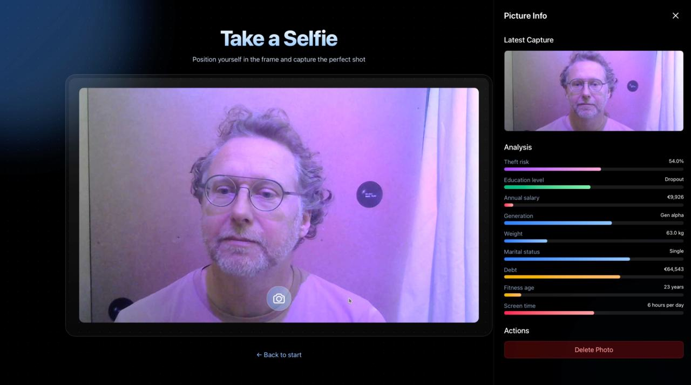  
_Resultaat van de bezoeker (toestemming is verkregen)_

## Dag 1

Op dag 1 waren we vroeg aanwezig, We moesten namelijk de muren van de photo booth meenemen vanuit de HvA naar Society 5.0 brengen.

Na de muren te hebben opgehaald, zijn we naar Society 5.0 gegaan om daar de muren in elkaar te zetten en klaar te staan voor de dag.

We hadden ook nog wat propaganda geprint, uitgeknipt en geplakt op de muren van de photo booth om het wat aantrekkelijker te maken voor de mensen.
Toen alles klaar stond, hebben we gewacht op de eerste bezoekers.

Eenmaal de eerste bezoekers binnenkwamen, hebben we ze geholpen met het gebruiken van de photo booth en uitleg gegeven over ons project.

Ook probeerden we zoveel mogelijk bezoekers binnen onze photo booth te laten komen door ze aan te spreken wanneer ze langs onze stand liepen.

Gedurende de dag hebben we veel bezoekers gehad die interesse toonden in ons project en we hebben veel positieve feedback gekregen.

Aan het einde van de dag hebben we de photo booth laten staan voor de volgende dag, zodat we niet alles opnieuw hoefden op te bouwen.

Al met al was dag 1 een succesvolle dag met veel interactie en interesse in ons project.

## Dag 2

Tijdens de avond/nacht tussen dag 1 en 2 van Society 5.0 zijn er enkele veranderingen doorgevoerd in de code achter de aannames om deze minder willekeurig en tegenstrijdig te maken. Zo kon je als je generatie Gen Alpha was geen studie hebben afgerond of getrouwd zijn, en als je wel een studie hebt afgerond worden je schulden hoger (studieschuld).

Net zoals op dag 1 probeerden we zoveel mogelijk mensen die langs de photo booth liepen erin te krijgen om een foto te laten nemen en hun feedback te krijgen. Al hadden we hiervoor een iets beter plan van aanpak, door aan een kant steeds mensen in het hokje te krijgen en nadat de bezoeker hun foto heeft gemaakt en de aannames bekeken heeft ze uit het hokje te halen en aan de kant nog in gesprek te gaan en ze de Google Forms laten invullen zodat er ruimte is bij het hokje voor een volgende gebruiker.

Gezien we op dag 1 al merkte dat er veel tijdens de Society 5.0 activiteiten het nogal rustig is in de lobby waar we stonden, zijn we op dag 2 meer naar workshops gegaan en tijdens de pauzes met meerdere bij de photo booth stonden om zoveel mogelijk bezoekers op te vangen.

Voor de rest van de sprint nemen we mee dat we de hardcoded aannames vervangen met een AI model, zodat we echte en accuratere aannames te verkrijgen. Verder zullen we de feedback uit de Google Forms meenemen om te verwerken in ons project.

## Reflectie

### Tijdens de expo hoopten we op de volgende resultaten

Duidelijk maken dat AI niet altijd zo betrouwbaar is als mensen soms denken.
De vraag bij gebruikers neerleggen of AI dit soort aannames wel zou moeten kunnen maken.

### Wat ging goed?

De ingevulde formulieren waren van hoge kwaliteit, dit kwam door een goed voorbereidde enquête gemaakt met Google Form. Hierin stonden een aantal vragen die ons hielpen om inzicht te krijgen in de gedachten en ervaringen van de bezoekers met betrekking tot ons prototype en de AI aannames.

Door de zelfgebouwde photo booth (Tom) vielen wij erg op tijdens de expo, waardoor we meer mensen hebben kunnen werven.

In onze test waren de resultaten random, dit wist de bezoeker echter niet. We merkte dat AI heel graag goed gepraat werd, in plaats van afgevraagd of de informatie wel klopt. Als wij een antwoord genereerde en 7/10 klopte, ging de gebruiker "smoesjes" of redenen zoeken voor de 3 die niet klopte.

### Wat gingen niet zoals verwacht

Op dag 1 merkte we dat dat na de fotosessie mensen vaak even bleven hangen voor een praatje, dit gebeurde naaste laptop waardoor nieuwe mensen dachten dat we bezet waren of durfde niet op ons af te stappen omdat we in gesprek waren. Dit hebben we op dag 2 opgelost door af te spreken dit gesprek niet voor de photo booth te doen maar aan de andere kant van het pad. Hierdoor is onze booth zelf meer toegankelijk.

Een aantal gebruikers hebben de Google Form niet ingevuld. Dit waren de mensen die hem later voor ons in zouden vullen. Dit is enigszins begrijpelijk wegens de vele activiteiten op de expo en de uitgebreide vragenlijst. De volgende keer zullen we ook kijken of we een deel van deze test mondeling kunnen afnemen en het formulier wat korter houden. Op deze manier kunnen we onze testresultaten na de vragenlijst veder aanvullen met specifiekere vragen.

## Wat nemen we mee?

Door de ingevulde enquêtes hebben we nuttige feedback gekregen. Deze feedback zullen we dan ook meenemen in de verdere ontwikkeling van ons project.

We gaan de hardcoded aannames vervangen met een AI model, zodat we hopelijk wat accuratere aannames kunnen verkrijgen.

Bovendien zullen we nadenken over hoe we de presentatie van ons project kunnen verbeteren, zodat we nog meer mensen kunnen bereiken en betrekken bij ons project.

Door de ervaringen tijdens de expo hebben we ook geleerd hoe we beter kunnen communiceren met bezoekers en hoe we onze presentatie kunnen aanpassen om meer interesse te wekken.

# Overzicht formulierdata

De Photo Booth vroeg bezoekers om een foto te maken en ontving vervolgens door AI gegenereerde “aannames” over henzelf (bijv. fitheidsleeftijd, schermtijd, schulden, enz.).  
Daarna vulden bezoekers een korte feedbackenquête in over hun ervaring.

- **Totaal aantal reacties:** 26
- **Leeftijdscategorie:** 18 – 60+
- **Meest voorkomende groep:** 18–25 (studenten)
- **Technologische bekendheid:** Voornamelijk mensen die _werken of studeren in tech/AI_ of _af en toe AI-tools gebruiken_.

## Verdeling van sentiment

Dit waren de gemiddelde gevoelens die mensen ervoeren bij het binnenkomen, interacteren of simpelweg in de buurt zijn van de photobooth.

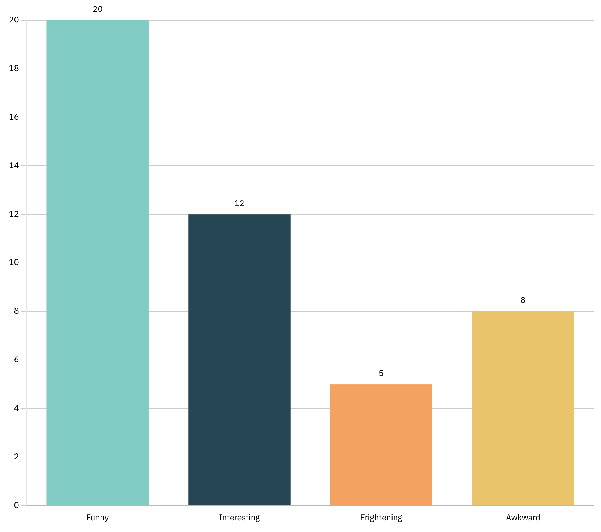  
_Bar Chart die gemiddelde emotie laat zien_

---

## Populaire thema's tijdens Society 5.0

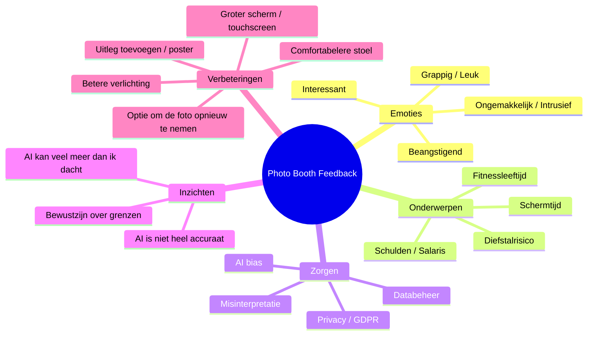

## Bestaande ervaring met AI

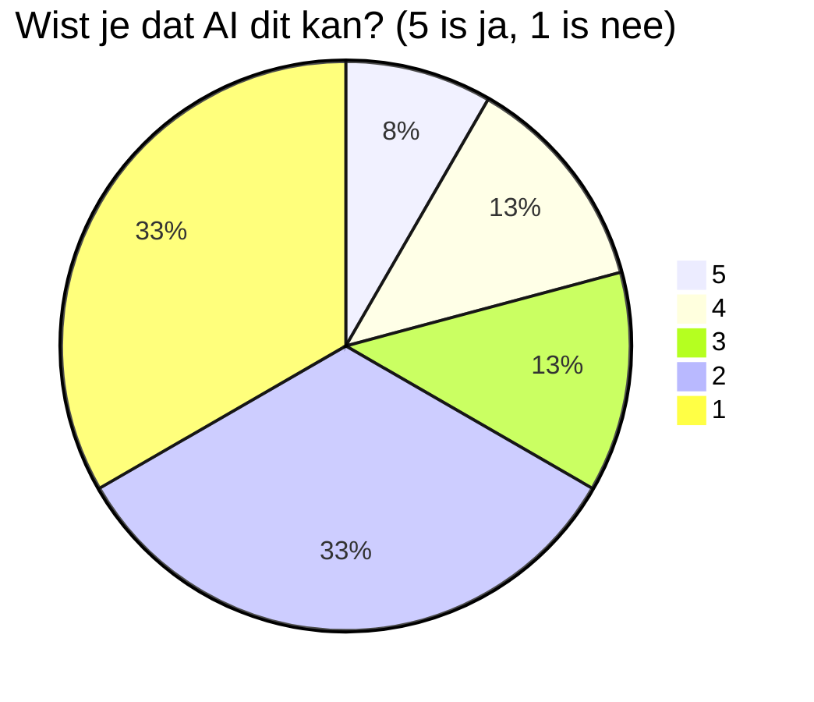

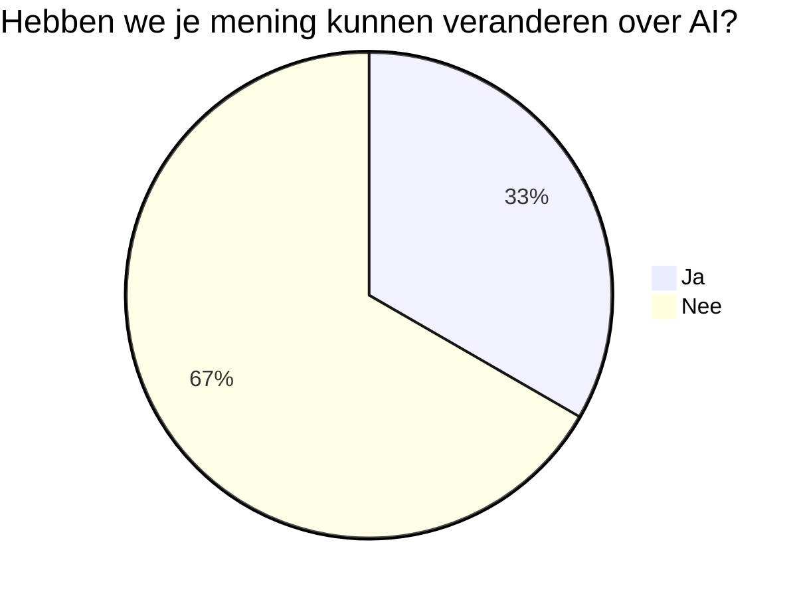

Zoals te zien is, bleven de meeste bezoekers bij hun oorspronkelijke mening over AI.
Toch slaagden we erin om ongeveer een derde (33%) van de deelnemers te overtuigen of hun kijk op AI te veranderen — een mooi resultaat gezien de korte interactietijd met de Photo Booth.

## Meest schokkende assumption

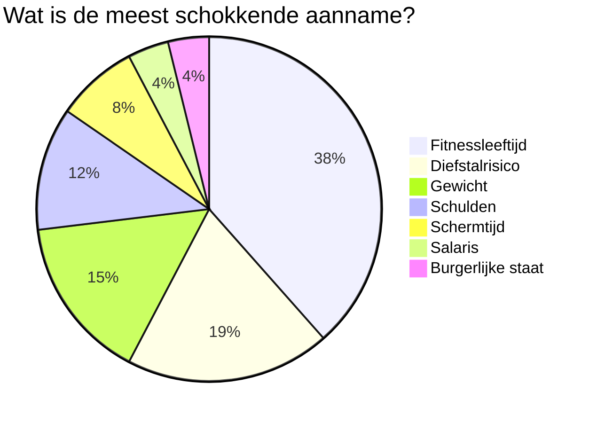
