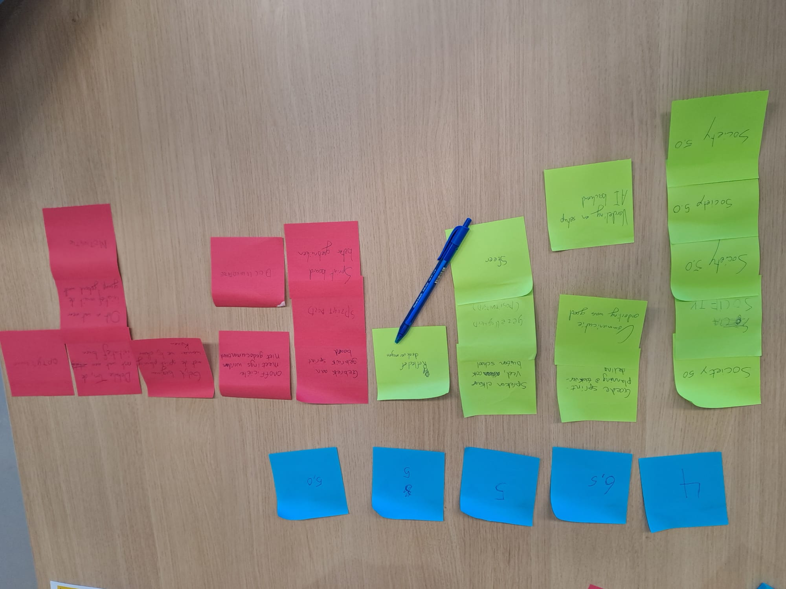
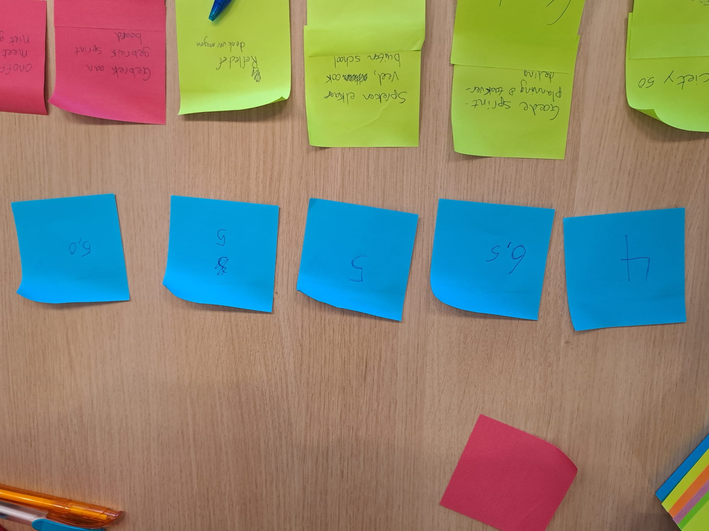
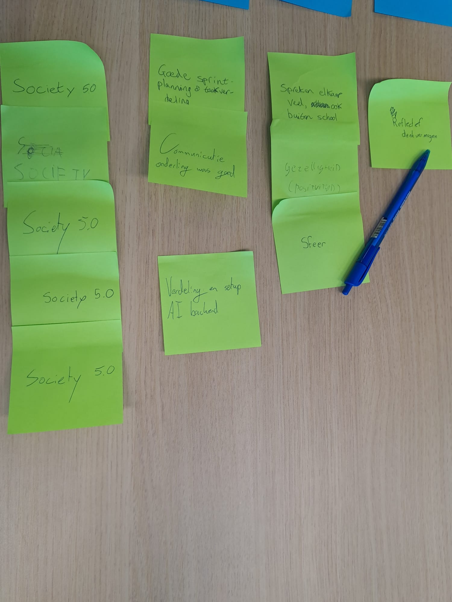
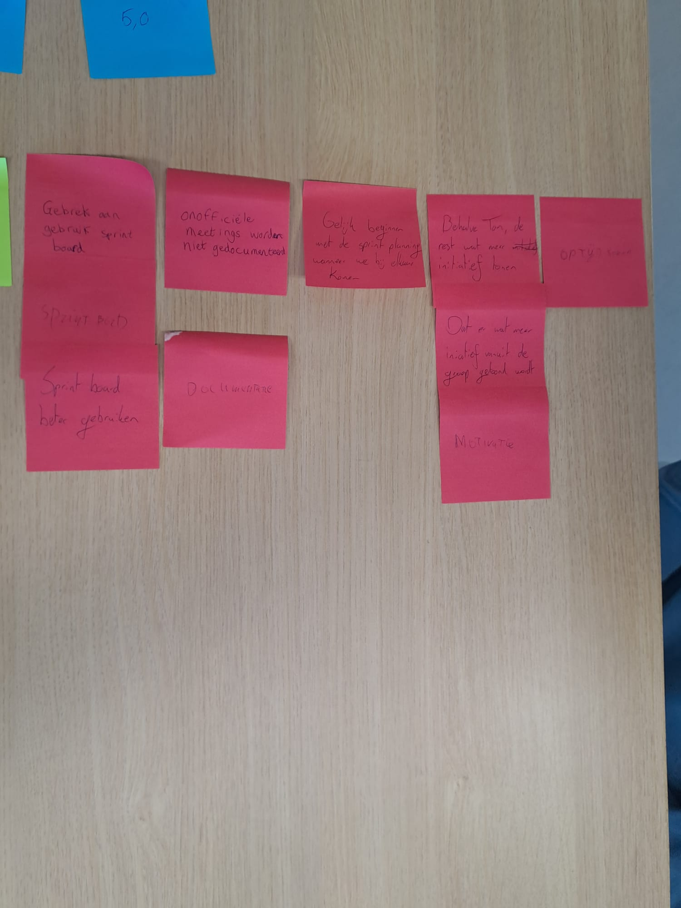

# Retrospective AH-methode

## Inleiding

Voor deze retrospective zijn we begonnen met allen een cijfer aan de sprint te geven om tastbare meting te maken van 
hoe we vonden dat de sprint was verlopen. We hebben ook onze cijfers onderbouwd en samengevat, zonder hierin in 
discussie te gaan. Vervolgens hebben we teruggeblikt op de actiepunten van de vorige sprint en gekeken in hoeverre we
hier op vooruit zijn gegaan. Hierna hebben we allen de tijd genomen om zelf op post-its te schrijven wat er goed ging
en wat er beter kan. Deze post-its hebben we vervolgens bij elkaar geplakt en geclusterd, waar nodig zijn de punten op 
de post-its concreet uitgelegd. Tot slot voor het gezamenlijke deel hebben we aan de hand van de post-its met punten
die minder goed gingen actiepunten opgesteld voor de volgende sprint. Daarna was er ruimte voor individuele reflecties.

## Sprintcijfers sprint 2

| Teamlid | Sprintcijfer |
|---------|--------------|
| Tom     | 4            |
| Borys   | 5            |
| Senna   | 5            |
| Jay     | 5            |
| Sjoerd  | 6.5          |

In het algemeen was er in het team weinig initiatief om werk te leveren. Ook vinden we zelf dat we niet tevreden zijn
met de hoeveelheid werk dat is verricht. Wat iedereen wel goed vond gaan, was Society 5.0, dit was een leuk evenement
die heel leerzaam was.

## Actiepunten vorige sprint

- De wekelijkse meetings zijn gehouden. Deze verliepen goed, maar werden niet gedocumenteerd.
- Er is een taakverdeling en planning goed gemaakt, alleen was deze slecht bijgehouden in ons sprintboard.
- Feature lock is niet toegepast. We willen de definitie van "feature lock" nog wat aanpassen, we zullen de high
  priority features max. 2 dagen van te voren pushen. Alle low priority features zullen nog worden geaccepteerd door de
  feature lock heen. Uiteraard willen we als doel behouden dat alle features 2 dagen van te voren af zijn, gecheckt 
  zijn en goed werken.

## Wat ging goed?

| Top                                   | Hoeveelheid |
|---------------------------------------|-------------|
| Society 5.0                           | 5           | 
| Goede sprintplanning en taakverdeling | 2           |
| Setup AI en Backend                   | 1           |
| Sfeer                                 | 3           |
| Reflectief denkvermogen               | 1           |

## Wat ging niet goed?

| Tip                                                                                                      | Hoeveelheid | 
|----------------------------------------------------------------------------------------------------------|-------------|
| Gebrek aan gebruik sprintboard                                                                           | 3           |
| Onofficiële meetings worden niet gedocumenteerd                                                          | 1           |
| Niet bestaande frontend documentatie                                                                     | 1           |
| Meteen beginnen met sprintplanning wanneer deze is afgesproken i.p.v. later thuis (Betere voorbereiding) | 1           |
| Weinig initiatief om werk te leveren (iedereen behalve Tom)                                              | 2           |
| Op tijd komen                                                                                            | 1           |

## Actiepunten voor volgende sprint

- Voor de volgende sprintplanning komt ieder teamlid met tenminste 3 extra user stories. Deze gaan we dan als team
  bespreken, filteren, en in het sprintboard zetten. Daarna gaan we als team er ook voor zorgen dat het sprintboard
  correct en tijdig wordt bijgehouden.
    - Hierdoor kunnen we ook ervoor zorgen dat we meteen beginnen met de sprintplanning wanneer deze staat ingepland.
- De documentatie moet echt stukke beter, met nadruk op onofficiële meetings en frontend. We gaan ervoor zorgen dat deze
  documentatie compleet en correct is, en dat deze door elk teamlid wordt nagelezen.
- Alle groepsleden moet gelijkaardige initiatief tonen om werk te leveren. We gaan ervoor zorgen dat iedereen zijn taken
  op tijd af heeft, en dat
  iedereen actief bijdraagt aan het project.
- Te laat komen wordt bijgehouden en zal worden afgestraft. Dit moet uiteraard een ongeldige reden zijn, zoals NS
  problemen of files.
    - Bij een kwartier te laat komen donuts trakteren.
    - Borys zal ervoor zorgen dat hij voor schooldagen max. tegen 1 uur in bed ligt.
- We spreken af dat we een meeting houden elke maandag, zoals voorheen. De tijd zal worden aangepast naar 11:30. Van te
  voren zorgen we ervoor dat we een gezamenlijk onderwerp hebben. We zorgen ervoor dat we voorbereid zijn als team (user
  stories, bespreekpunten, etc.). Als onderling besproken is dat de meeting geen meerwaarde heeft, wordt deze
  geannuleerd.

## Individuele reflecties per persoon

### Tom

Over het algemeen ben ik tevreden met mijn persoonlijke voortgang deze sprint. Ik heb veel kunnen leren over het implementeren van AI en de backend architectuur. 

Mijn ontwikkeldoel deze sprint was om mijn kennis van AI te verdiepen. Hier heb ik een ontwikkelplan voor opgesteld. Hier staan een aantal actiepunten in waaronder het bekijken van een tutorialserie, het lezen van een beginners vriendelijke introductie tot transformers, en tot slot mijn ouders uitleggen hoe AI werkt om mijn begrip te testen.

De tutorialserie heb ik bekeken en per video in mijn persoonlijk ontwikkelplan genoteerd wat ik eruit heb gehaald. Deze videos hebben mij geholpen om een beter begrip te krijgen van de principes van AI en hoe dit in de praktijk wordt toegepast. Ook gingen de video's vrij diep in op de wiskundige en programmeer aspecten van AI.   
Door de video's was het artikel over transformers een stuk makkelijker te begrijpen. Ik heb het artikel gelezen en samengevat.  
Vanavond ga ik mijn ouders proberen uit te leggen hoe AI werkt. Ik noteer hun vragen en mijn antwoorden in mijn ontwikkelplan samen met een cijfer van hen over hoe goed ik het heb uitgelegd.

Voor de volgende sprint ga ik kijken naar hoe LLMs zoals GPT filters toepassen op hun output en hoe ik dit eventueel kan omzeilen voor mijn project.

Gebruikte middelen:

- Video serie "Neural Networks" van 3Blue1Brown op YouTube [https://www.youtube.com/playlist?list=PLZHQObOWTQDNU6R1_67000Dx_ZCJB-3pi](https://www.youtube.com/playlist?list=PLZHQObOWTQDNU6R1_67000Dx_ZCJB-3pi)
- Artikel "A Beginner-Friendly Look at Transformers" van Digital Ocean [https://www.digitalocean.com/community/tutorials/transformers-attention-is-all-you-need](https://www.digitalocean.com/community/tutorials/transformers-attention-is-all-you-need)
- Artikel "What is attention" van Machine Learning Mastery [https://machinelearningmastery.com/what-is-attention/](https://machinelearningmastery.com/what-is-attention/)
- Artikel "The Attention Mechanism from Scratch" van Machine Learning Mastery [https://machinelearningmastery.com/the-attention-mechanism-from-scratch/](https://machinelearningmastery.com/the-attention-mechanism-from-scratch/)
- Online boek "Neural Networks and Deep Learning" van Michael Nielsen [http://neuralnetworksanddeeplearning.com/](http://neuralnetworksanddeeplearning.com/)

### Sjoerd

Ik ben in deze sprint dieper gedoken in de werking van AI en mijn vergaarde kennis samengevat en gedocumenteerd voor in
mijn PDP. Hierna ben ik begonnen met het onderzoeken van waarom en hoe AI hallucineert, wat een basis geeft voor mijn
leerdoel. Ook heb ik deze sprint een voortgangsevaluatie gehad met Marise en mijn leergroep-buddy om de voortgang van
mijn leerdoelen te bespreken en feedback te krijgen. Dit is verwerkt in de laatste versie van mijn PDP.
Ik heb tijdens de sprint gewerkt met Google AI Studio om Gemini te implementeren in onze applicatie. Van de AI-modellen
die we in onze applicatie willen verwerken zal deze het meest worden gebruikt omdat deze zonder kosten te gebruiken is.
Tot slot heb ik deze sprint de retrospective geleid en het team geïntroduceerd met de retrospective methode zoals ik 
deze heb geleerd tijdens mijn stage bij Albert Heijn, wat hopelijk leidt tot een betere en effectievere retrospective.

Voor de volgende sprint wil ik me verdiepen in hoe AI effectiever kan worden aangeroepen, om zo hallicinaties te 
verminderen en de consistentie van de output van AI-modellen te verbeteren.

### Senna

### Jay

Ik heb in sprint 2 kunnen werken aan mijn ontwikkelplan en heb ik verschillende taken uitgevoerd die bijdragen aan mijn persoonlijke en professionele groei als AI Developer.
Tijdens de sprint heb ik gewerkt met OpenAI's GPT-4 API om met een foto assumpties te genereren voor de persoon die een foto wilt maken in de photo booth.  
Ik heb dit met Marise besproken en daarna geïmplementeerd in de code. Enige waar ik tegen vast liep is dat je voor de API een betaalde account nodig hebt.  
Daarnaast heb ik ook gewerkt aan het beter begrijpen van de ethische implicaties van AI-technologieën en hoe deze op een verantwoorde manier kunnen worden ingezet.  
Hier heb ik tijdens society 5.0 veel van opgepikt tijdens dat mensen bij ons in de photo booth kwamen en ik met hun in gesprek ging over hoe we onze booth hebben gemaakt.

Verder ben ik pas tevreden met het resultaat als het werkt. Op society 5.0 bijvoorbeeld hadden we al een werkend iets en daar was ik tevreden mee.
Nu het volgende doel is dat met AI te maken en dan dat werkend te krijgen. Als dit werkt zou dit mijn bewijsstuk zijn dat ik het kan.

### Borys

## Bijlagen

