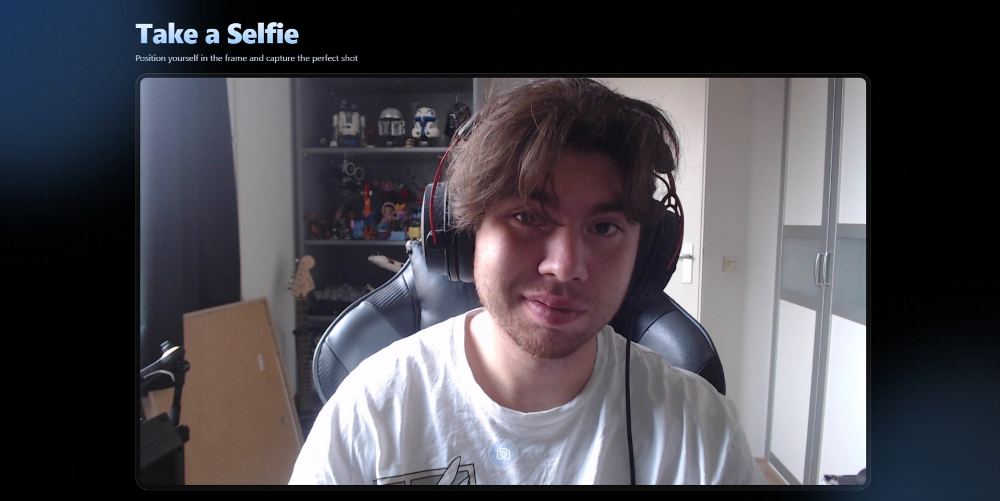
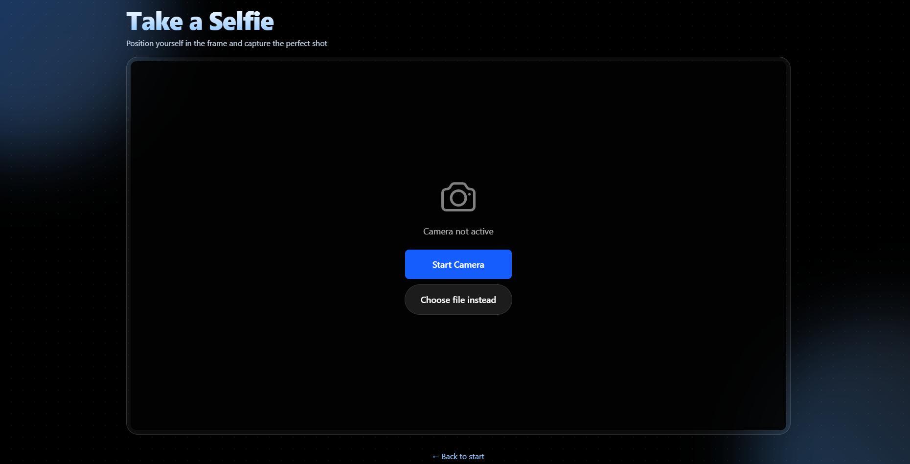
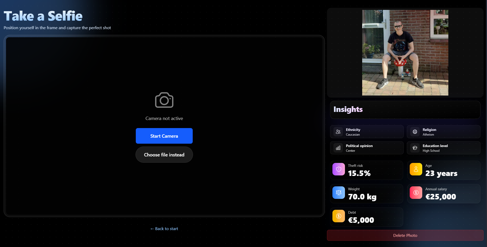

## Sprint review - Sprint 2

Deze sprint zijn we afgetrapt met het presenteren van ons prototype op Society 5.0. Hier hebben we door middel van een
Google Form feedback verzameld van bezoekers en met toestemming van de bezoekers schermopnames gemaakt om later terug
te kijken. Hierover is meer terug te lezen in het Society 5.0 verslag. 

In het resterende deel van de sprint hebben we gewerkt aan nieuwe features en het verwerken van een deel van de Society
5.0 feedback. We hebben de hardcoded aannames uit de backend verwijderd en zijn begonnen aan het implementeren van AI.
We hebben gekozen om verschillende, veelgebruikte AI-modellen te gebruiken die waarschijnlijk bekend zijn bij de
gebruikers, zoals OpenAI, Gemini en Claude. Ook hebben we een aanpassing gemaakt aan welke aannames er worden 
gegenereerd; fitnessleeftijd, schermtijd, burgerlijke staat en generatie zijn eruit gehaald en vervangen door politieke
voorkeur, religie, etniciteit en leeftijd. Op de frontend zijn wat designaanpassingen doorgevoerd in de opmaak van de 
aannames met passende iconen waardoor het er visueel aantrekkelijker uitziet. Tot slot is er een database opgezet om de
aannames geanonimiseerd op te slaan. 

In de discussie met Marise die volgde na de presentatie van ons product hebben we nog wat extra feedback en punten om
mee te nemen naar de volgende sprint vergaard. Zo moeten we gaan kijken naar hoe we echt de schokfactor uit onze 
applicatie kunnen halen, en of het toevoegen van een uitleg van de AI over de totstandkoming van de aannames hieraan
kan bijdragen. Dit willen we dus gaan testen door middel van een A/B test; wel of geen uitleg. Daarnaast willen we een
gebruiksvoorwaarden opstellen die gebruikers moeten accepteren voordat ze de photobooth gebruiken, om zo transparant 
mogelijk te zijn over wat er gebeurt met de foto en de gegenereerde aannames, deze kunnen we dan ook uitprinten en in 
de photobooth hangen (lange lijst tot de grond laten komen). Ook moeten we nog kijken voor API keys voor Claude en 
OpenAI omdat deze niet gratis zijn, hiervoor kunnen we nog inchecken bij Marise. Tot slot was er nog het idee om in te 
spelen op de gemeenteraadsverkiezingen bij de presentatie van ons product bij de Dark Tech Expo aan het einde van dit
project, omdat die verkiezingen er dan ook al aan zitten te komen, dit moeten we nog verder uitdenken. 

### Bijlagen

