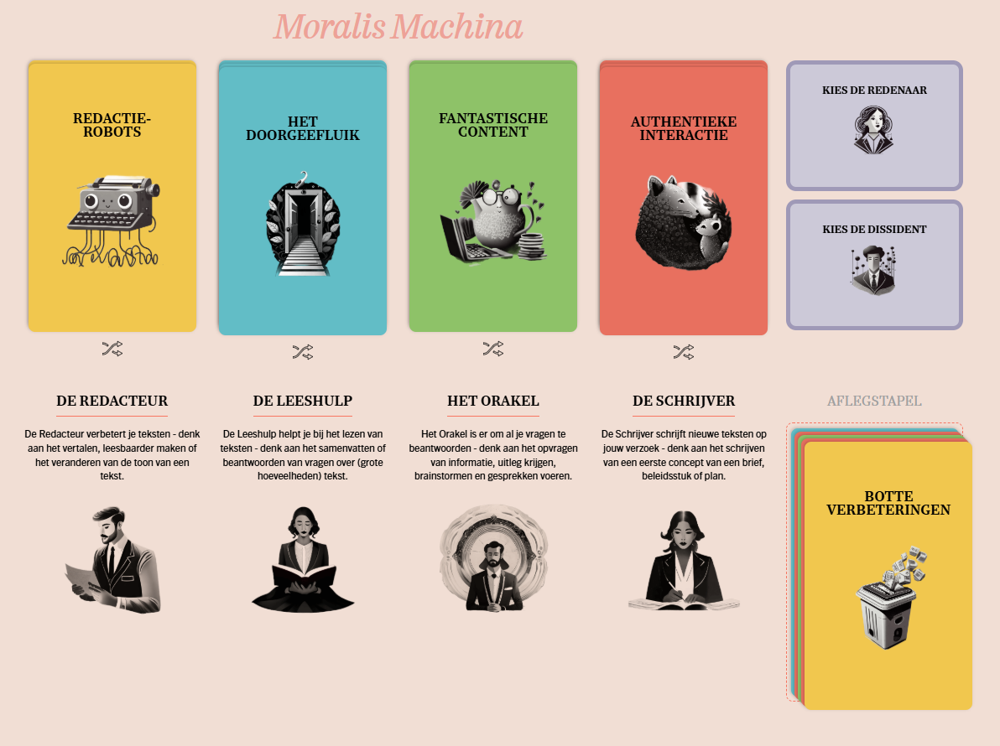

# Sprint 3 - 24 november 2025

## Aanwezig

- Senna
- Borys
- Jay
- Sjoerd
- Tom

## Afwezig

- Geen

## Agenda

1. Sprint vooruitgang
2. Studio.Next
3. Moralis Machina

## Sprint vooruitgang

We hebben deze sprint veel vooruitgang geboekt. De website is live met een secured domein. De belangrijkste
functionaliteiten zijn geïmplementeerd, behalve wat lagere prioriteit features. We moeten nog wat meer gebruikerstesten
uitvoeren en feedback verwerken, maar we liggen op schema om alles op tijd af te ronden.

## Studio.Next

Voor Studio.Next hebben we bedacht om A/B testing te doen met en zonder het reasoning gedeelte van de AI. We willen
kijken of het reasoning gedeelte daadwerkelijk bijdraagt aan betere resultaten. De tijdsloten voor de tests zijn van 12:
00 tot 16:00.

Er is besloten dat de groep van woensdag de test doet zonder reasoning en de groep van donderdag met reasoning. We
zullen de resultaten vergelijken en bespreken in de volgende sprint meeting. Tom zal de functionaliteit opzetten voor de
A/B test en Jay zal de assumpties voor OpenAI afmaken.

## Moralis machina

Moralis Machina is een project van Responsible
IT ([https://moralis.responsible-it.nl/](https://moralis.responsible-it.nl/)). Het doel van dit project is om
bewustwording te creëren over de ethische implicaties van AI-gebruik op de werkvloer. Wegens tijdgebrek hebben we
besloten om de kortere versie te doen. Hierin behandelen we elk een eigen kaart, wel minimaal een van elke categorie.

### De Ratrace (Tom)

#### Stelling

We gebruiken AI-tools om documenten samen te vatten, zodat we sneller kunnen werken. Sommige collega's vinden het tempo
te hoog en voelen zich onder druk gezet.
Hoe bespreken we de verwachtingen over het wel/niet gebruik maken van AI?
Hoe kunnen we ervoor zorgen dat er geen grote verschillen ontstaan tussen collega's bij het werken met AI?

#### Discussie

- Senna: AI moet niet verboden worden, maar ook niet verplicht gesteld. Met AI werk je misschien sneller, maar het is
  niet eerlijk om te verwachten dat iedereen hetzelfde tempo kan aanhouden. Als je achter loopt, is dat oké. Het is aan
  de manager om mensen gerust te stellen. AI mag gebruikt worden als die ervan leert. Manager geen onderscheidt maken
  van wel of niet gebruik AI.
- Tom: Met AI kan je sneller werken, maar het is belangrijk dat snelheid niet ten koste gaat van kwaliteit. Voor een
  project is het belangrijk dat iedereen weet waar je wel/niet AI gebruikt. Zo voorkom je misverstanden en frustraties
  binnen het team. Ook zorgt dit ervoor dat vaardigheden blijven ontwikkelen.

### Kopzorgen over kopij (Senna)

#### Stelling

De AI-tool die we gebruiken kopieert soms teksten van andere auteurs zonder bronvermelding.
Hoe gaan we om met auteursrechten en AI-gegenereerde content?
Hoe zorgen we voor originele content met juiste verwijzingen?

#### Discussie

- Senna: AI mag alleen met toestemming van de auteur teksten gebruiken en afbeeldingen generen. Maar met toestemming is
  het prima. Ik ben er tegen dat AI teksten zonder bronvermelding gebruikt.
- Tom: AI heeft heel veel data nodig om te leren. Het is onmogelijk om te controleren of AI alleen met toestemming
  teksten/afbeeldingen gebruikt. We kunnen ons beter focussen op het controleren van AI. Door AI niet de hele taak te
  geven, maar AI als hulpmiddel te gebruiken. Door zelf de tekst te schrijven en AI alleen te gebruiken voor inspiratie
  of grammatica controle houd je de controle en voorkom je problemen met auteursrechten.

### Luiwammes (Borys)

#### Stelling

De AI-tool geeft oppervlakkige antwoorden, waardoor we belangrijke context missen.
Hoe zorgen we ervoor dat we voldoende begrip voor de context en complexiteit van problemen blijven houden?
Hoe verbeteren we het kritisch denken van zowel de AI-tool als onszelf?

#### Discussie

- Borys: Als je merkt dat context mist, ga met elkaar zitten, maak vraag template voor vragen die je kan stellen aan de
  AI. Testen of het werkt
- Tom: Door iemand anders te laten kijken naar de antwoorden. Kan je erachter komen of je iets mist. Daarnaast kan je
  voorkomen dat AI te oppervlakkig antwoord geeft door van te voren genoeg context mee te geven.

### Creatieve crisis (Jay)

#### Stelling

AI neemt steeds meer van ons (schrijf)werk over. Sommigen ervaren dit als belemmering voor hun creativiteit.
Hoe kunnen we onze eigen creativiteit stimuleren terwijl we steeds meer AI gebruiken voor (schrijf)werk?
Hoe zorgen we dat AI een hulpmiddel blijft en niet een doel op zich wordt?

#### Discussie

- Jay: Denk eerst zelf over je eigen werk, wat je wilt doen. Als je dit duidelijk heb hier AI voor te gebruiken.
- Sjoerd/Tom: Vraag AI voor inspiratie, maar schrijf zelf het werk.

Laat AI ons werk niet overnemen, maar ons werk verbeteren.

### Botte verbeteringen (Sjoerd)

#### Stelling

We gebruiken AI om onze communicatie te verbeteren. Nu zeggen ontvangers dat onze berichten te algemeen en niet
persoonlijk genoeg zijn.
Hoe houden we berichten persoonlijk wanneer we gebruik maken van AI?
Wat hebben we nodig om onze communicatie voldoende authentiek te maken?

#### Discussie

- Sjoerd: Mij valt op dat als je door AI een tekst laat schrijven door code completion, dat je vaak zelf de tekst alsnog
  overschrijft. Je kan tegenwoordig vaak AI systemen trainen op je eigen schrijfstijl. Dan blijft het persoonlijker.
  Niet vragen om hele teksten te kopieren en plakken, maar lees het na en pas het aan naar je eigen stijl.

De groep is het hier mee eens.

### Afbeelding spel

