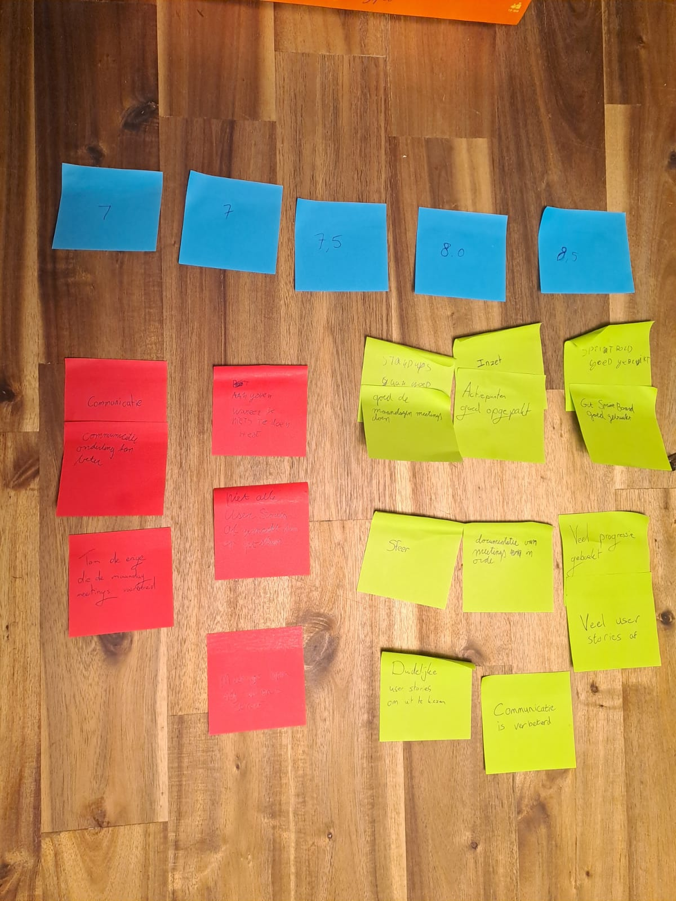
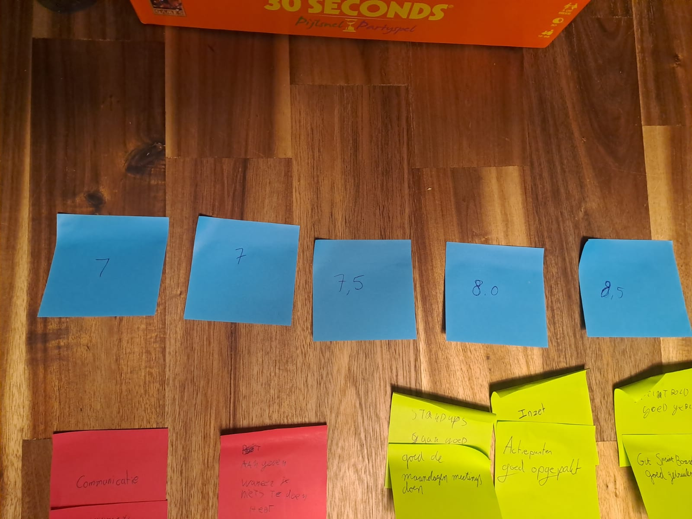
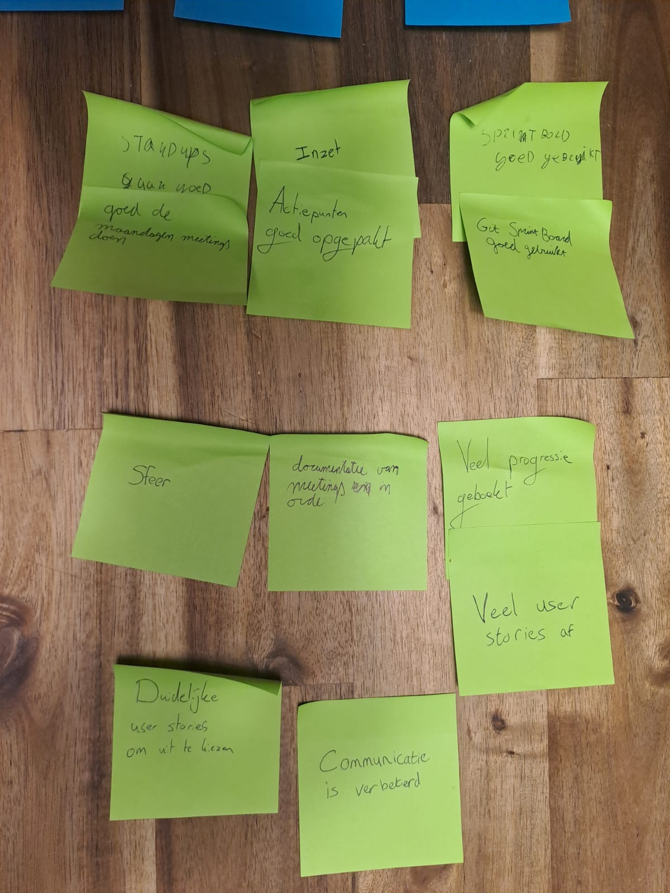
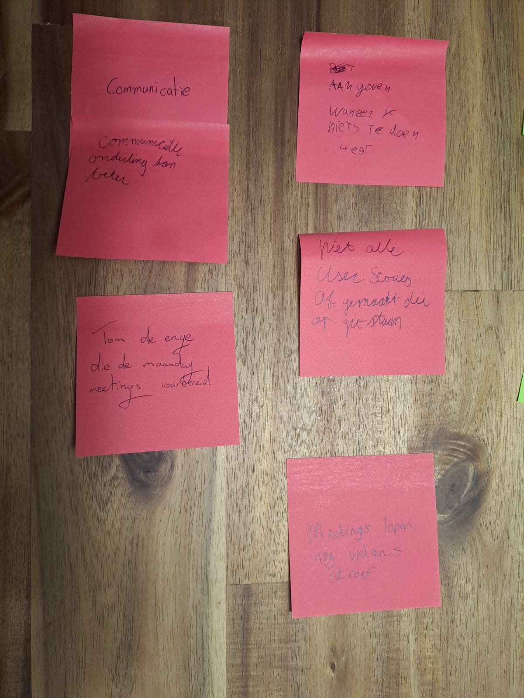

# Retro sprint 3

## Inleiding

Voor deze retrospective zijn we begonnen met allen een cijfer aan de sprint te geven om tastbare meting te maken van
hoe we vonden dat de sprint was verlopen. We hebben ook onze cijfers onderbouwd en samengevat, zonder hierin in
discussie te gaan. Vervolgens hebben we teruggeblikt op de actiepunten van de vorige sprint en gekeken in hoeverre we
hier op vooruit zijn gegaan. Hierna hebben we allen de tijd genomen om zelf op post-its te schrijven wat er goed ging
en wat er beter kan. Deze post-its hebben we vervolgens bij elkaar geplakt en geclusterd, waar nodig zijn de punten op
de post-its concreet uitgelegd. Tot slot voor het gezamenlijke deel hebben we aan de hand van de post-its met punten
die minder goed gingen actiepunten opgesteld voor de volgende sprint. Daarna was er ruimte voor individuele reflecties.

## Cijfers

| Naam        | Cijfer |
|-------------|--------|
| Borys       | 7      |
| Senna       | 7      |
| Tom         | 7,5    |
| Sjoerd      | 8      |
| Jay         | 8,5    |

Wij zijn erg tevreden over de sprint. We hebben veel werk verzet en zijn goed op schema gebleven. De samenwerking verliep
vlot en we hebben elkaar goed kunnen ondersteunen waar nodig. Er zijn natuurlijk altijd verbeterpunten, maar over het algemeen zijn we erg tevreden met hoe de sprint is verlopen.

## Actiepunten vorige sprint

- Voor de volgende sprintplanning komt ieder teamlid met tenminste 3 extra user stories. Deze gaan we dan als team
  bespreken, filteren, en in het sprintboard zetten. Daarna gaan we als team er ook voor zorgen dat het sprintboard
  correct en tijdig wordt bijgehouden.
    - Hierdoor kunnen we ook ervoor zorgen dat we meteen beginnen met de sprintplanning wanneer deze staat ingepland.
- De documentatie moet echt stukke beter, met nadruk op onofficiële meetings en frontend. We gaan ervoor zorgen dat deze
  documentatie compleet en correct is, en dat deze door elk teamlid wordt nagelezen.
- Alle groepsleden moet gelijkaardige initiatief tonen om werk te leveren. We gaan ervoor zorgen dat iedereen zijn taken
  op tijd af heeft, en dat iedereen actief bijdraagt aan het project.
- Te laat komen wordt bijgehouden en zal worden afgestraft. Dit geldt uiteraard niet bij een geldige reden, zoals NS
  problemen of files.
    - Bij een kwartier te laat komen donuts trakteren.
    - Borys zal ervoor zorgen dat hij voor schooldagen max. tegen 1 uur in bed ligt.
- We spreken af dat we een meeting houden elke maandag, zoals voorheen. De tijd zal worden aangepast naar 11:30. Van te
  voren zorgen we ervoor dat we een gezamenlijk onderwerp hebben. We zorgen ervoor dat we voorbereid zijn als team (user
  stories, bespreekpunten, etc.). Als onderling besproken is dat de meeting geen meerwaarde heeft, wordt deze
  geannuleerd.

Sprintplanning is goed verlopen, het actiepunt over de sprintplanning hebben we opgevolgd en zijn tevreden over hoe deze is verlopen. Ieder is met drie user stories gekomen en we hebben deze gelabeld en de eerste user stories onderling verdeeld. Het sprintboard is ook goed bijgehouden. De onofficiële meetings zijn erg goed gedocumenteerd en door elk teamlid nagelezen. Frontend documentatie is nog steeds een aandachtspunt. Senna en Borys hebben medegedeeld dat ze hiermee aan de slag zullen gaan. Het actiepunt omtrent initiatief tonen is niet helemaal opgevolgd. Voor de volgende sprint gaan we een concreter actiepunt opstellen. Borys is niet meer te laat gekomen, dus het document is niet geupdate. De maandag meetingen zijn zoals afgesproken ingepland en verliepen goed. Een keer is de meeting geannuleerd omdat er geen meerwaarde was. 

## Wat ging goed

| Top                                   | Hoeveelheid |
|---------------------------------------|-------------|
| Inzet                           | 2           | 
| Sprintboard goed bijgehouden | 2 |
| Stand-ups gaan goed | 2 |
| Documentatie van meetings | 1 |
| sfeer | 1 |
| Duidelijke user stories om uit te kiezen | 1 |
| Veel progressie geboekt | 2 |
| Communicatie verbeterd | 1 |

## Wat ging niet goed?

| Tip                                                                                                      | Hoeveelheid | 
|----------------------------------------------------------------------------------------------------------|-------------|
| Communicatie                                                                           | 2           |
| Aangeven wanneer je niets te doen hebt | 1 |
| Tom de enige die maandag meetings organiseert | 1 |
| Niet alle user stories af | 1 |
| Meetings lopen soms wat stroef | 1 |

## Actiepunten volgende sprint

- Om individuele initiatief te stimuleren, stellen we per week een nieuwe SCRUM master aan. De scrum master wordt geroteerd op basis van achternaam. De scrum master is verantwoordelijk voor het organiseren van de maandag meetings, het bijhouden van het sprintboard, en inchecken dat niemand bij zijn taken vastloopt. Ook zorgt hij dat de meetings genoteerd worden. 

We merken dat de meetings wat stroef lopen. Het wordt af en toe net iets te gezellig, waardoor we de focus verliezen. Om dit te voorkomen, zal de scrum master voor een meeting start een notulist aanwijzen. Deze persoon is verantwoordelijk voor het bijhouden van de orde en de samenvatting van de meeting.
- Notulist wijst de groep erop als het te gezellig wordt en de focus verloren gaat.

## Individuele reflecties per persoon

### Sjoerd

Ik kijk positief terug over deze sprint. We zijn goed van start gegaan door ter voorbereiding op de planning allemaal 
user stories te schrijven, waardoor we aan het begin van de sprint gelijk een taakverdeling konden maken en iedereen
aan de slag kon. Ik heb mij bezig gehouden met de gebruikersvoorwaarden, de beredenering van de AI en zorgen dat de AI
flow alleen wordt aangeroepen als er een gezicht op de foto wordt gedetecteerd. Ik had tijdens de retrospective 
aangegeven dat ik wel vind dat onze meetings nog weleens stroef verlopen, dit komt doordat het vaak te gezellig wordt 
en we van het pad afdwalen waar ik mij wel aan stoor, wat de duur van meetings onnodig verlengd wat ten kosten gaat van 
tijd die we kunnen gebruiken om onze taken te verrichten. Hier was het team het mee eens en hebben we een actiepunt 
voor opgesteld, namelijk om de aangewezen notulist de groep erop te wijzen als het te gezellig wordt en de focus 
verloren gaat zodat we bij de punten van de agende blijven. We hebben gekozen om deze taak op de notulist te leggen 
omdat die persoon toch het meeste bezig is met wat er in de meeting wordt besproken. Voor mijn PDP heb ik mij deze 
sprint verder verdiept in hoe/waarom hallucinaties ontstaan bij het gebruik van AI en hoe je dit kan voorkomen, zodat 
ik bij het gebruik van AI de output consistenter kan houden. Ook heb ik mij verdiept in Computer Vision, wat niet 
direct op mijn leerdoelen slaat, maar wel bij mijn profiel past. Dit had ik al eerder op het oog, maar niet 
gedocumenteerd, maar naar aanleiding van de VE1 leek Marise het interessant als ik onderwerpen buiten mijn leerdoel met 
betrekking tot AI ook zou documenteren.

### Jay
Ik ben erg tevreden over hoe de sprint is verlopen. We hebben veel werk verzet en de samenwerking verliep vlot. 
Ik denk dat we als team goed hebben samengewerkt en elkaar goed hebben ondersteund waar nodig. Dit kan je ook terug zien
in het cijfer wat ik de sprint heb gegeven, een 8,5. Waar ik vooral tevreden over ben is over hoe we de sprint hebben
opgepakt met zijn allen. Iedereen heeft zijn taken serieus genomen en we hebben als team goed samengewerkt om onze doelen te
bereiken. Ten opzichte van vorige sprint hebben we als team echt stappen gemaakt. Voor mijzelf heb ik gewerkt aan de VPS 
draaiend krijgen met een domein en de OpenAI Assumpties werkend krijgen. Ik had een aantal kleine blockers waardoor ik 
in het begin niet veel voortgang kon maken met de openAI Assumpties, namelijk dat ik een creditcard nodig had om de API 
key te gebruiken. Ik had dit gelijk geregeld maar het duurde langer dan verwacht voordat ik mijn creditcard binnen kreeg.
Verder nadat ik mijn creditcard binnen kreeg kon ik verder werken en het product werkte toen in mijn eigen branch, maar 
nadat ik dev had gemerged in mijn branch werkte het ineens niet meer. Na wat debuggen kwam ik erachter dat er een probleem was
en heb ik dit opgelost. Achteraf kon ik misschien beter hulp vragen om iemands creditcard te lenen maar dacht zelf niet dat het
zo lang zou duren voordat ik mijn eigen creditcard binnen kreeg. Natuurlijk zijn er altijd verbeterpunten, maar over het 
algemeen ben ik erg tevreden met hoe de sprint is verlopen. Wat ik zelf nog zou willen verbeteren aan mijzelf is dat ik 
nog proactiever kan zijn in het aangeven wanneer ik ergens hulp bij nodig heb. Soms wacht ik te lang voordat ik om hulp 
vraag, waardoor ik vastloop. Dit is iets waar ik aan wil werken in de volgende sprint.

### Tom

Deze sprint verliep voor mij erg soepel en ben tevreden over wat we als team hebben bereikt. Ik heb deze sprint vooral gewerkt aan de database en enquête functionaliteit. Samen met Senna heb ik de database structuur opgezet en bewerkt. Daarna heb ik de enquête functionaliteit opgezet, zodat gebruikers ons feedback kunnen geven zonder dat we er erg bovenop staan. Ook zijn de resultaten in het formulier verwerkt, zodat de gebruiker terug kan kijken naar hun resultaat. Ook heb ik de opzet gemaakt voor de A/B testing op Studio.Next, zodat we kunnen testen of het reasoning gedeelte van de AI daadwerkelijk bijdraagt aan betere resultaten. Al met al ben ik erg tevreden over hoe de sprint is verlopen en kijk ik uit naar de volgende sprint. 

Ik vond de samenwerking goed gaan. Het actiepunt om ieder met drie user stories te komen heeft goed geholpen om de sprintplanning vlot te laten verlopen en zorgde ervoor dat er genoeg werk was voor iedereen. Doordat het sprintboard goed gevuld was, bleef de motivatie naar mijn idee ook hoog. De maandag meetings verliepen goed, al merkte ik dat ik vaak de enige was die deze organiseerde en documenteerde. Ook dwaalde de focus vaak af naar andere onderwerpen, waardoor de meetings langer duurden dan nodig. We hebben hier een concreter actiepunt voor opgesteld om dit in de volgende sprint te verbeteren. 

We hebben alle belangrijke user stories af kunnen ronden, een paar optionele features schuiven we door naar de volgende sprint. Maar dit was van tevoren al ingeschat, dus naar mijn mening is het volgens de planning verlopen. Al deze punten bij elkaar opgeteld, geef ik deze sprint een 7,5. Ik ben verder gegaan met mijn persoonlijke ontwikkeling in het delen van kennis over AI. Ik heb, zoals voorgesteld, een korte uitleg gegeven over de werking van ChatGPT aan Marise. Marise deed alsof ze geen verstand van AI had, zodat ik de uitleg eenvoudig moest houden. Dit ging erg goed en ze liet weten dat het een duidelijke uitleg was. Marise gaf niet aan dat ik verkeerde informatie had gegeven of iets had gemist, dus ik beschouw dit als een succes.

Tijdens deze sprint merkte ik dat ik moeite heb met het uit handen geven van werk. Ik neem taken snel volledig op me, omdat ik bang ben dat anderen het niet goed genoeg of niet op mijn manier uitvoeren. Dit kwam duidelijk naar voren bij het maken van de enquête op de website, waar ik veel te lang aan bleef doorwerken om alles te perfectioneren. Ook merkte ons team dat meetings soms minder effectief verliepen, waardoor we een actiepunt hebben opgesteld om de samenwerking tijdens meetings te verbeteren. Volgende sprint wil ik meer vertrouwen op mijn team en realiseren dat taken delen niet betekent dat het resultaat minder goed wordt. Voor de volgende sprint neem ik me dan ook voor om maar 1 user story in "to do"/"doing" op mijn naam te hebben. Daarnaast wil ik vooraf duidelijker afspraken maken over verwachtingen, zodat ik me veiliger voel bij het overdragen van werk. Dit gaan we doen door tijdens de sprintplanning en bij het maken van nieuwe user stories met zijn alle de gemaakte taken in de beschrijving goed door te lopen. Dit moet mij helpen om minder tijd kwijt te zijn aan perfectioneren en meer focus te krijgen op het geheel. Aan het eind van de sprint ga ik evalueren of dit invloed heeft gehad op mijn mijn tijdsbesteding en de kwaliteit van onze samenwerking.

## Bijlagen

